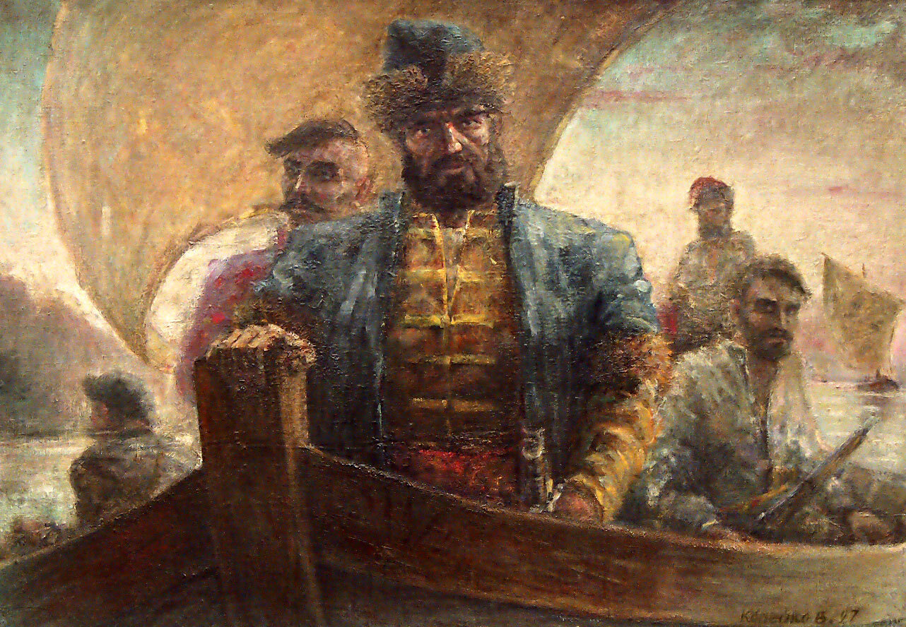

#  Битва с племенем


## Сюжет
Вы играете за Ермака Тимофеевича. Вы и ваш отряд отправился колонизировать остальные земли Перми, но вы попали в окружение диких уральских племен. После яростной битвы с племенем вы оказались совершенно одни в окружении. Ваша цель продержаться 3 минуты и победить вождя племени после чего вы сможете вернуться к своему отряду.

## Команда
Пайгемеры

## Язык программирования
Python

## Библиотека / Движок
* PyGame
* PyGt5

## Состав команды
* Михайлов Кирилл
* Голубчиков Рома
* Якимов Михаил
* Волегова Наталья

## Запуск игры
```
git clone https://github.com/KirillMikhailov442/perm-game.git

cd perm-game

pip install -r requirements.txt

python main.py
```
